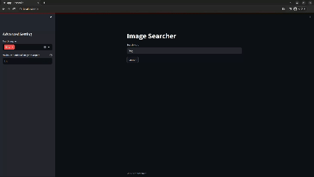

# image-search-app

Search and save images from Bing and Google using Streamlit and icrawler.



## Requirements

- [uv](https://docs.astral.sh/uv/)

The required Python version is managed through `.python-version` and installed by
uv when necessary.

## Setup

```shell
git clone https://github.com/tomcat930/image-search-app.git
cd image-search-app
uv sync --locked
```

## Usage

Launch the app.

```shell
uv run streamlit run app.py
```

Open <http://localhost:8501> in a browser. Search results are saved in a unique
directory below `images/` for each run, with separate directories for Bing and
Google.

The maximum number of images per search engine can be set from 1 to 500.

## Tests

```shell
uv run python -m unittest discover -s tests -v
```

## Docker

Alternatively, launch the app with Docker Compose.

```shell
docker compose up -d
```
